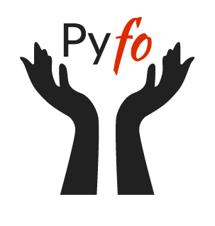

<div align="center">
  <a href="https://github.com/bradleygramhansen/pyfo"> </a>
</div>


Pyfo enables one to write a model in the incredibly flexiable first order probabilistic programming framework
that is FOPPL. FOPPLs base language is Clojure, which enables the syntax to be neat, yet completely expressive. See
(ML-wood group tutorial for an introduction to FOPPL. The backend for FOPPL is Discountinous HMC [^fn1], which allows one to
perform inference in models that have discontinuities that are of measure 0 [^fn2]. In addition to this, we included an
automated framework for embedding discrete distributions, which allows one to perform inferrence in dsicrete models,
using Hamiltonina Monte Carlo::

    write model in foppl, for example one_dim_gauss.clj

    i.e.
    ```clojure
    (def one-gaussian
        (foppl-query
            (let [x (sample (normal 1.0 5.0))]
                (observe (normal x 2.0) 7.0)
            x)))
    ```

    Then in your python script:

    ```python
    import DHMC
    from DHMC.inference.DHMC as DHMC
    n_burnin = 1000
    n_sample = 10 ** 4
    stepsize = 0.03
    trajectorystep = [10, 20]
    # Either this
    DHMC    = dhmc.DHMC(logp, start, step_size, n_steps, **kwargs)
    dhmc.sample(n_samples, n_burnin, n_chains)
    # or this
    DHMC_object = DHMC(one_dim_gauss.clj, stepsize, trajectorystep, n_burnin, n_samples) # creates sampler object

    samples = DHMC_object.samples # returns samples of the inferred posterior
    ```


[^fn1]: Nishimura, Akihiko, David Dunson, and Jianfeng Lu. "Discontinuous Hamiltonian Monte Carlo for sampling discrete parameters." arXiv preprint arXiv:1705.08510 (2017).

[^fn2]: Yuan, Gram-Hansen, Hongsoek, Stanton, Wood. "Hamiltonian Monte Carlo for Non-Differentiable Points in Probabilistic Programming Languages."